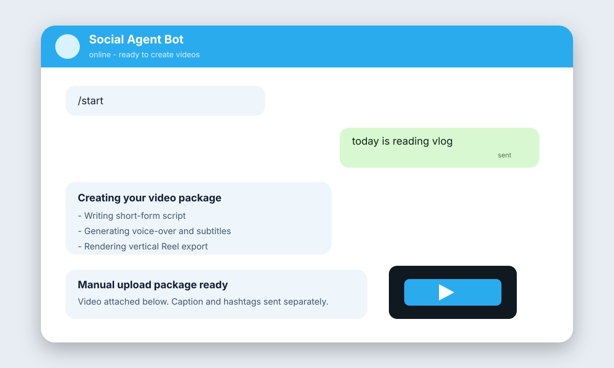
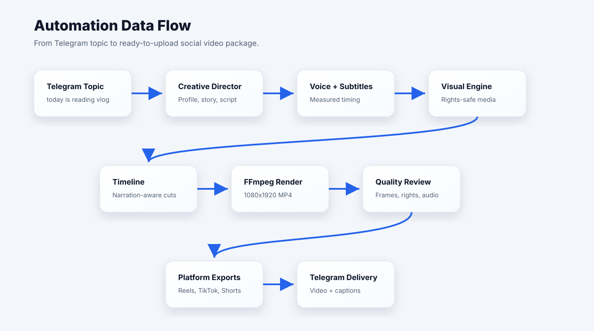

# Social Media Automation by Telegram

An autonomous social-video workspace controlled from Telegram. The app turns a simple topic such as `today is reading vlog` into a ready-to-upload short-form video package with captions, hashtags, quality reports, and platform-ready exports.

The current product is optimized for manual publishing: the system prepares the final assets and sends them to Telegram, then the creator uploads them to Instagram Reels, TikTok, or YouTube Shorts.

## Preview

### Telegram Bot Control



### Data Flow



## What It Does

- Accepts topics from Telegram or the web dashboard.
- Builds a brand and content context from a website URL.
- Creates short-form scripts and captions.
- Generates local voice-over and subtitles.
- Selects or generates rights-safe visuals.
- Renders vertical 1080x1920 videos with FFmpeg.
- Produces platform-ready files for Instagram, TikTok, and YouTube Shorts.
- Sends the finished package to Telegram for manual posting.
- Stores local quality reports, rights manifests, captions, hashtags, and timelines.

## Current Output Package

Each finished video render can produce:

- `master-premium.mp4`
- `instagram-reel.mp4`
- `tiktok.mp4`
- `youtube-short.mp4`
- `cover.jpg`
- `caption.txt`
- `hashtags.txt`
- `quality-report.json`
- `rights-manifest.json`
- `timeline.json`

Generated media, uploads, secrets, and local app data are intentionally ignored by Git.

## Architecture

```text
Telegram / Dashboard
        |
        v
Topic + Website Context
        |
        v
Creative Director
        |
        v
Script + Voice + Subtitles
        |
        v
Semantic Clip / Visual Engine
        |
        v
Timeline + Render Plan
        |
        v
FFmpeg Renderer
        |
        v
Premium Quality Review
        |
        v
Platform Exports
        |
        v
Telegram Delivery
```

## Tech Stack

- TypeScript
- React + Vite
- Express API
- Telegram Bot API
- Zod validation
- FFmpeg / FFprobe
- Vitest
- Local JSON state for development

## Folder Structure

```text
server/                 API, Telegram runtime, local database, workflow orchestration
src/creative/           Creative brief, concept profile, script writing
src/video/              Timeline, renderer, profiles, background generation
src/voice/              Local voice provider and voice director
src/subtitles/          Subtitle generation
src/quality/            Technical and premium quality scoring
src/platform/           Platform export validation
src/media/              Local media analysis
src/telegram/           Telegram command parsing and controller logic
docs/                   Product, setup, architecture, and operating docs
tests/                  Automated tests
```

## Setup

Install dependencies:

```bash
npm install
```

Create your local environment file:

```bash
cp .env.example .env.local
```

Add only the credentials you want to use locally. Never commit `.env.local`.

Start the app:

```bash
npm run dev
```

Run the Telegram polling worker:

```bash
npm run telegram:poll
```

Check local readiness:

```bash
npm run doctor
```

Build for production:

```bash
npm run build
```

Run tests:

```bash
npm test
```

## Telegram Commands

Typical commands:

```text
/start
/status
/quality
/package
today is reading vlog
today is AI video trends
pause
resume
emergency stop
```

The bot only accepts messages from configured allowed Telegram user IDs.

## Environment Variables

See [.env.example](.env.example).

Common local values:

```text
TELEGRAM_BOT_TOKEN=
TELEGRAM_ALLOWED_USER_IDS=
SOCIAL_PUBLISH_MODE=mock
VOICE_SPEED_MULTIPLIER=1.25
```

`VOICE_SPEED_MULTIPLIER` controls post-processing speed for local voice-over. The default is currently `1.25`.

## Video Pipeline

The premium video workflow is:

1. Create a `VideoConceptProfile`.
2. Write a short spoken script.
3. Generate voice-over.
4. Measure real voice duration.
5. Generate phrase-based subtitles.
6. Build a narration-aware timeline.
7. Select rights-safe visuals or generate topic-specific fallback visuals.
8. Render a vertical master video.
9. Extract review frames.
10. Score technical and creative quality separately.
11. Export platform files.
12. Send the package to Telegram.

## Quality Gates

The project separates:

- `technicalPass`: format, duration, subtitles, rights, render success.
- `creativePremiumPass`: voice quality, clip relevance, story, framing, color, pacing, audio mix, and human-editor feel.

A video can be technically ready while still being blocked from being labeled premium.

## Security

- `.env.local` is ignored.
- Local generated folders are ignored.
- Telegram access is restricted by allowed user IDs.
- External visuals must have traceable rights metadata.
- The app does not bypass platform restrictions or use browser automation for unauthorized posting.
- Real social posting is disabled unless explicitly configured through official APIs.

## Manual Publishing

This project currently prepares upload-ready files and captions. The creator manually uploads the final video to social platforms.

Automatic publishing should only be enabled when official API credentials, permissions, and platform requirements are configured.

For TikTok auto-upload, save `TIKTOK_CLIENT_KEY`, `TIKTOK_CLIENT_SECRET`, and `TIKTOK_REDIRECT_URI` locally first. TikTok also requires Login Kit OAuth and approved Content Posting API scopes such as `video.publish` for direct posting or `video.upload` for upload-to-inbox flows.

Run `npm run dev:all` for local automation. It keeps the web app and Telegram bot running without sending repeated scheduled upload packs.

After TikTok OAuth is approved and `TIKTOK_ACCESS_TOKEN` is saved locally, run `npm run tiktok:upload` to upload the latest generated TikTok export through the official Content Posting API. Use `npm run tiktok:upload -- --mode draft` for TikTok inbox upload flow when the app has `video.upload` scope.

If TikTok is connected through Buffer, save `BUFFER_API_KEY` and `BUFFER_TIKTOK_CHANNEL_ID`, host the MP4 at a public URL, then run:

```bash
npm run buffer:schedule -- --video-url https://your-public-host/video.mp4 --minutes 10
```

Buffer requires media URLs to be publicly reachable until the post publishes, so local paths like `D:\Work\automation\outputs\...` cannot be sent directly.

Recommended Vercel setup: create/connect a Vercel Blob store, pull `BLOB_READ_WRITE_TOKEN` into `.env.local`, then run:

```bash
npm run buffer:schedule -- --minutes 10
```

The script uploads the latest TikTok MP4 to Vercel Blob automatically, then schedules the Buffer post with the public Blob URL.

## Development Notes

The app is designed to keep costs low by default:

- Local rendering
- Local voice-over
- Local storage
- Mock social posting
- Telegram-first review

Premium external voice, licensed stock footage, or cloud storage can be added later without changing the core workflow.
